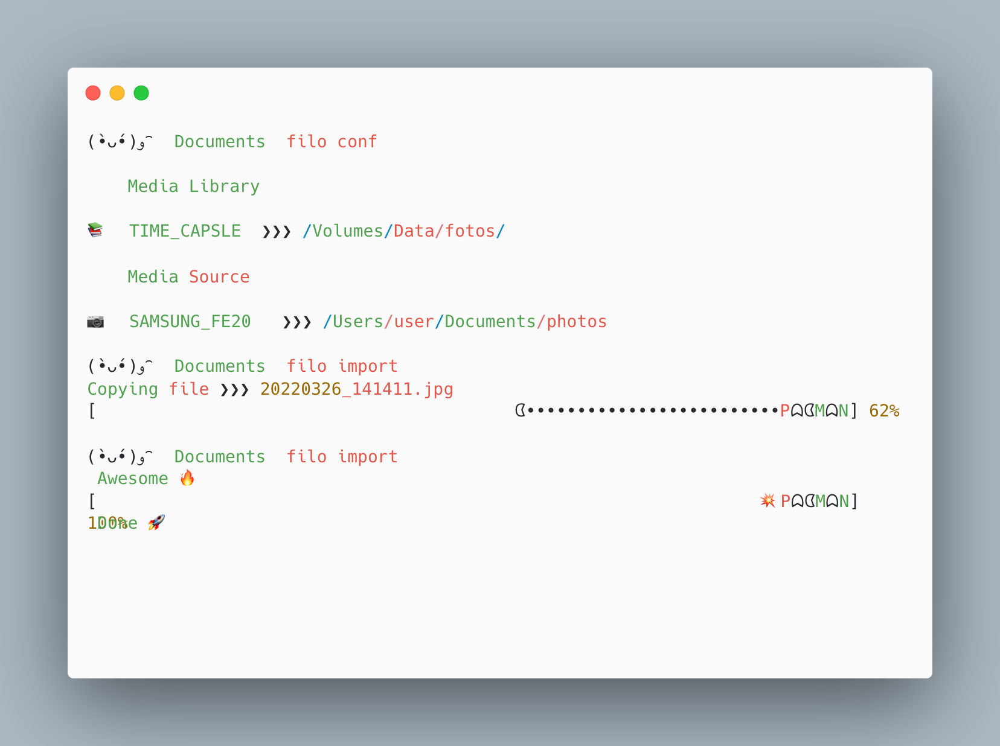

# filo

A description of this package.

### Installation

The ```ffprobe``` is being utilized, make sure it is installed.
The ```libexif``` dev library is utilized. Make sure it is installed.
To install it on Ubuntu run.
```
apt install -y libiptc-data libexif-dev libiptcdata0-dev
```
To install it on Mac using brew run:
```
 brew install libexif libiptcdata
```
Export the environment variable for the headers:

```
export CPATH=$(brew --prefix libexif)/include
export C_INCLUDE_PATH=$(brew --prefix libexif)/include
```
To build from Sources, run:
```
 swift build
```


